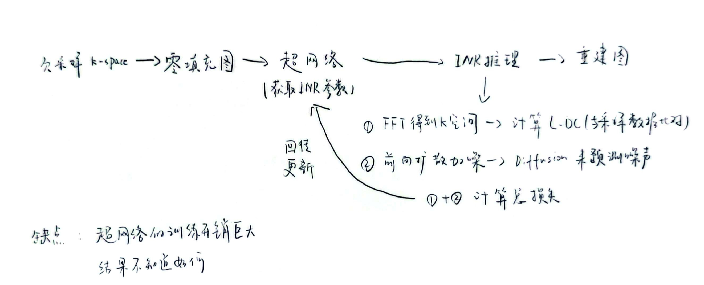
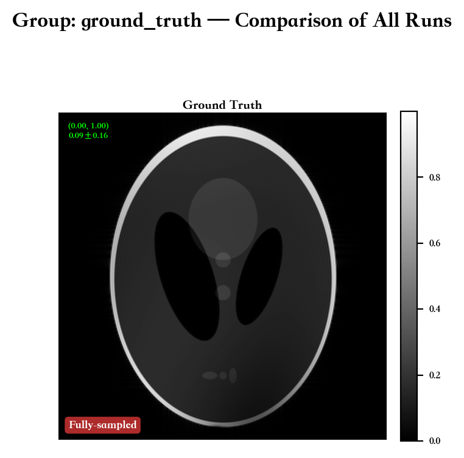
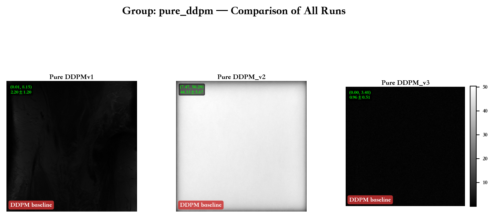
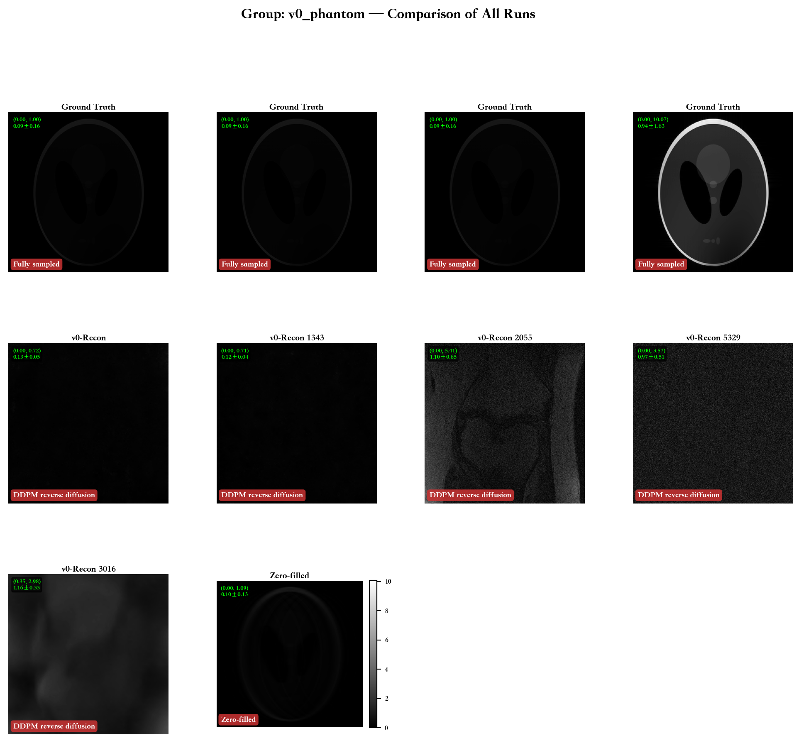
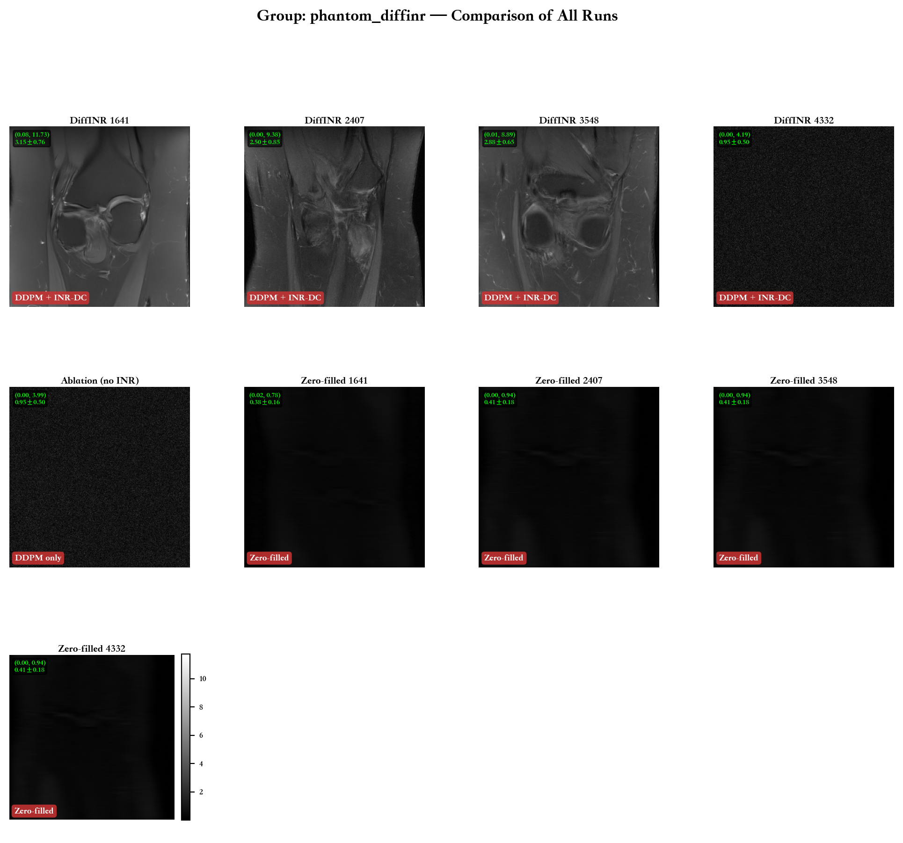
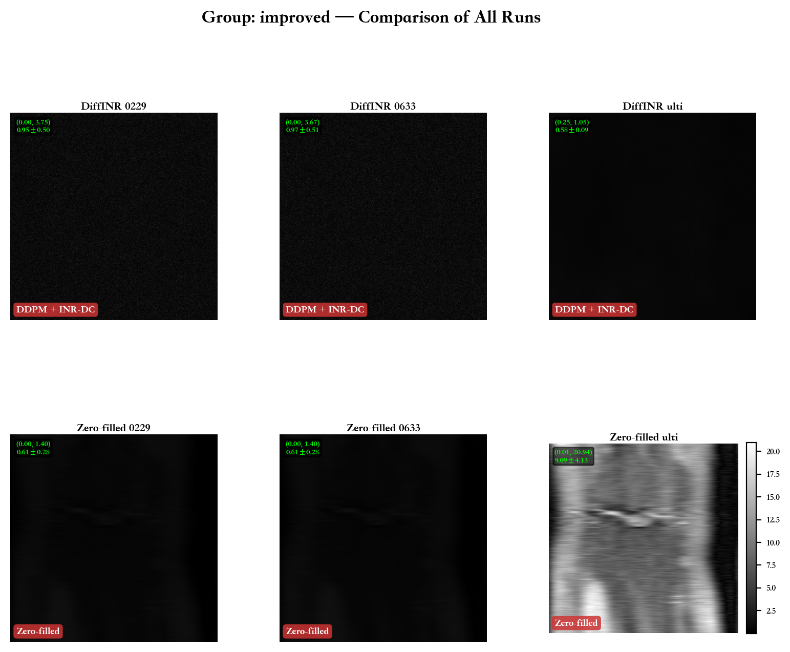

# DiffINR — Implicit Neural Representation for MRI Reconstruction

> **复现论文**: [Highly accelerated MRI via implicit neural representation guided posterior sampling of diffusion models](https://www.sciencedirect.com/science/article/pii/S1361841524003232) (Medical Image Analysis, 2025)
>
> **目标**: 基于 HFS-SDE (TMI 2024) 的 VP-SDE 预训练权重，自实现论文 Algorithm 1 的 DDPM-style 反向扩散采样流程，集成 INR 数据矫正（INR-DC），验证其在 MRI 欠采样重建上的效果。

---


### Stage 0: 论文路线阐述
我的理解是使用 diffusion 模型作为基础，利用 inr 来学习该模型输出的图像，再使用 k-space 欠采样数据进行矫正后输出图像返回 diffusion 模型进行循环推理，打个比方，我可以把 diffusion 模型看作是骨架，而由 k-space 数据校正的 inr 为血肉，血肉逐步在骨架上填充，最终生成完整图像

既然如此，这个循环优化的过程我想既可以以 diffusion 模型为骨架，也应该可以为 inr 为骨架，利用 diffusion 模型来优化约束，但是有个相同的限制就是需要一个预训练的 inr 模型，不知道这个想法是否可行

另外在运行代码的时候，我的 gpu 是 2080ti，感觉到速度很慢，我想不仅是因为 gpu 本身的原因，还有一个原因是整个推理是串行的 diffusion->inr->diffusion->inr->diffusion。另外一篇学习的论文 NePR 相对快速，甚至可以直接在我的 M2 芯片的笔记本上运行，且速度尚可。

所以是否有这种可能，欠采样 MRI 数据通过超网络动态生成隐式神经表示的权重来重建图像，并在训练时联合 k 空间物理一致性损失与预训练扩散模型的真实度损失进行端到端优化，那样是否可以一步直接出图，如下图



### Stage 1: 代码

## 项目结构

```
diffinr_code/
├── README.md                         #   本文档 — 学习路线图
├── config.py                         #   配置参数
├── main.py                           #   主入口
├── requirements.txt                  #   依赖
│
├── diffinr/                          #     核心模块
│   ├── diffinr_sampler.py            #     Algorithm 1 采样器
│   ├── inr_dc.py                     #     INR 数据一致性模块
│   ├── hash_encoding.py              #     HashEncoding
│   ├── inr_mlp.py                    #     Tiny MLP
│   └── forward_operator.py           #     MRI 前向算子 A=MFS
│
├── hfs_sde/                          #     HFS-SDE 复用的代码
│   ├── models/                       #     Score network
│   ├── sde_lib.py                    #     VPSDE / marginal_prob
│   └── utils/                        #     工具函数
│
├── checkpoint/                       # 预训练权重 (需自行下载)
│   └── vpsde/checkpoint_190.pth
│
├── data/
│   └── photom/                       # Phantom 测试数据
│
├── mask/                             # 欠采样模板 (.mat)
│
└── results/                          #    实验结果
    ├── README.md                     #    整体分析
    ├── ground_truth/                 #    GT 真值
    ├── v0_phantom/                   #    v0 早期实验
    ├── phantom_diffinr/              #    主实验
    ├── improved/                     #    改进版本
    ├── pure_ddpm/                    #    DDPM 基线
    └── back_up/                      #    原始数据归档
```


#### 核心算法流程

```
x_T ~ N(0, I)
for step = T(2000) -> 1:
    t_cont = (step-1) / T

    1. Reverse diffusion (Eq.11):
        β(t) = β_min + t_cont · (β_max - β_min)
        β_step = β(t) / T
        x_{t-1} = (1 + 0.5·β_step)·x_t + β_step·s_θ(x_t, t) + √β_step·ε

    2. Tweedie denoising (Eq.6):
        x_{0|t-1} = (x_{t-1} - √(1-ᾱ(t))·s_θ) / √ᾱ(t)

    3. INR-DC (if t > t* and (t-1) % k == 0):
        Stage 1: Prior embedding — L2 loss ||INR(d) - x₀||²  (lr=1e-3, 250it)
        Stage 2: DC refinement   — L1 loss ||A·INR(d) - y||₁ (lr=1e-5, 250it)
        Noise remap: x_{t-1} = √ᾱ(t)·x̂₀ + √(1-ᾱ(t))·ε
```

### 实验与测试

| 阶段 | 实验 | 状态 |
|------|------|------|
| Step 1 | HFS-SDE 原始推理确认环境 |
| Step 2 | 自实现 DDPM 采样 (无 INR-DC) |  `pure_ddpm/` |
| Step 3 | INR 模块独立功能验证 |
| Step 4 | 完整 DiffINR pipeline | `phantom_diffinr/` |
| Step 5 | 有/无 INR-DC 对比 (ablation) | `phantom_diffinr/` |
| Step 6 | 改进版本 (缩放修复) | `improved/` |

### 结果对比图

| Ground Truth | Pure DDPM |
|:---:|:---:|
|  |  |

| v0 Phantom | DiffINR |
|:---:|:---:|
|  |  |

| Improved |
|:---:|
|  |

---

### 结果分析文件说明

| 分组 | 内容 | 链接 |
|------|------|------|
| **Ground Truth** | 完全采样真值 | `results/ground_truth/` |
| **v0 Phantom** | 早期复数域重建 | `results/v0_phantom/` |
| **DiffINR 主实验** | 完整管线 + ablation | `results/phantom_diffinr/` |
| **Improved** | 缩放修复后 | `results/improved/` |
| **Pure DDPM** | 无 INR-DC 基线 | `results/pure_ddpm/` |
| **完整分析** | 实验结果整体总结 | `results/README.md` |

---


## 实验结果

| 组 | 最佳 Recon 均值 | 备注 |
|----|----------------|------|
| Ground Truth | 0.09 (幅度) | 全采样 phantom 真值 |
| Pure DDPM v3 | 0.96 | 无 INR-DC 基线 |
| DiffINR (184332) | 0.95 | 主实验收敛版 |
| DiffINR Improved | 0.95~0.97 | 缩放修复后稳定版 |
| Fake Multi-coil | 0.58 | 模拟多线圈功能验证 |

> **当前状态**: Pipeline 跑通，INR-DC 功能正常。数值范围已收敛。重建质量与 GT 仍有差距，需进一步优化。


## 参考文献

- [DiffINR (Medical Image Analysis, 2025)](https://www.sciencedirect.com/science/article/pii/S1361841524003232) — 本论文
- [HFS-SDE (TMI, 2024)](https://github.com/Byungjoo00/HFS-SDE) — 预训练权重来源
- [Score-Based Generative Modeling through SDEs (NeurIPS, 2021)](https://arxiv.org/abs/2011.13456) — 理论基础
- [Instant-NGP (SIGGRAPH, 2022)](https://github.com/NVlabs/instant-ngp) — Hash Encoding 参考

---

